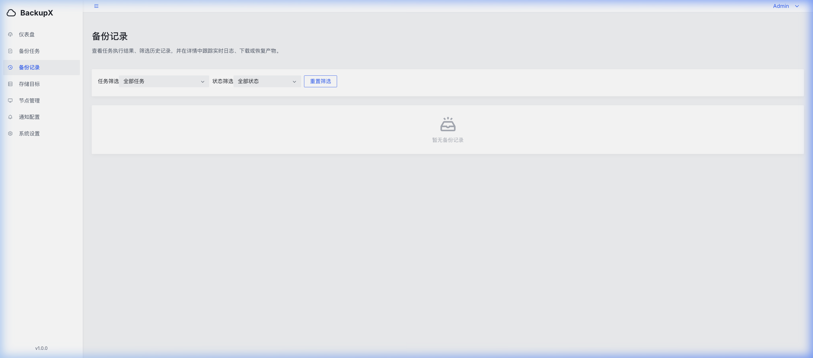

<p align="right">
  <a href="README.md">English</a> | <strong>中文</strong>
</p>
<p align="center">
  <h1 align="center">BackupX</h1>
  <p align="center">
    <strong>自托管服务器备份管理平台</strong><br>
    一个二进制，一条命令，管好你所有服务器的备份。
  </p>
  <p align="center">
    <a href="https://github.com/Awuqing/BackupX/stargazers"></a>
    <a href="https://github.com/Awuqing/BackupX/releases"></a>
    
    
    
    <a href="LICENSE"></a>
  </p>
  <p align="center">
    <a href="https://awuqing.github.io/BackupX/zh-Hans/"><strong>文档</strong></a> ·
    <a href="https://github.com/Awuqing/BackupX/releases"><strong>下载</strong></a> ·
    <a href="https://hub.docker.com/r/awuqing/backupx"><strong>Docker Hub</strong></a>
  </p>
</p>

---

<table>
<tr>
<td width="50%"></td>
<td width="50%"></td>
</tr>
<tr>
<td></td>
<td></td>
</tr>
</table>

## 功能亮点

| 能力 | 说明 |
|------|------|
| **备份类型** | 文件/目录（多源路径）、MySQL、PostgreSQL、SQLite、SAP HANA（完整/增量/差异/日志备份 + 并行通道 + 失败重试） |
| **SAP HANA Backint 代理** | 内置 SAP HANA Backint 协议代理，HANA 原生备份接口可直接把数据路由到 BackupX 支持的任意存储后端 |
| **70+ 存储后端** | 内置阿里云 OSS / 腾讯云 COS / 七牛云 / S3 / Google Drive / WebDAV / FTP + 通过 rclone 集成 SFTP、Azure Blob、Dropbox、OneDrive 等 70+ 后端 |
| **自动调度** | Cron 定时 + 可视化编辑器 + 自动保留策略（按天数/份数清理，自动回收空目录） |
| **多节点集群** | Master-Agent 模式，基于 HTTP 长轮询跨多台服务器管理备份。Agent 本地执行任务并直接上传到存储，无需反向连通性 |
| **安全** | JWT + bcrypt + AES-256-GCM 加密配置 + 可选备份文件加密 + 完整审计日志 |
| **通知** | 邮件 / Webhook / Telegram，备份成功或失败时自动推送 |
| **部署** | 单二进制 + 内嵌 SQLite，Docker 一键启动，零外部依赖 |

## 快速开始

```bash
# Docker（推荐）
docker run -d --name backupx -p 8340:8340 -v backupx-data:/app/data awuqing/backupx:latest

# 或使用预编译包
curl -LO https://github.com/Awuqing/BackupX/releases/latest/download/backupx-linux-amd64.tar.gz
tar xzf backupx-*.tar.gz && cd backupx-* && sudo ./install.sh
```

打开 `http://your-server:8340`，创建管理员账户，按 [5 分钟快速开始](https://awuqing.github.io/BackupX/zh-Hans/docs/getting-started/quick-start) 完成首次备份。

## 文档

完整文档见 **https://awuqing.github.io/BackupX/zh-Hans/** — 快速开始、部署、SAP HANA、多节点集群、API 参考等。

快捷链接：

- [快速开始](https://awuqing.github.io/BackupX/zh-Hans/docs/getting-started/quick-start) — 五分钟跑通第一个备份
- [安装](https://awuqing.github.io/BackupX/zh-Hans/docs/getting-started/installation) — Docker / 裸机 / 源码
- [多节点集群](https://awuqing.github.io/BackupX/zh-Hans/docs/features/multi-node) — 远程服务器部署 Agent
- [SAP HANA 支持](https://awuqing.github.io/BackupX/zh-Hans/docs/features/sap-hana) — hdbsql Runner 与原生 Backint
- [API 参考](https://awuqing.github.io/BackupX/zh-Hans/docs/reference/api) — REST 端点

## 开发

```bash
git clone https://github.com/Awuqing/BackupX.git && cd BackupX
make dev-server          # 终端 1：后端（:8340）
make dev-web             # 终端 2：前端（Vite HMR）
make test                # 运行全部测试
make build               # 产出 server/bin/backupx + web/dist
```

更多细节见 [开发指南](https://awuqing.github.io/BackupX/zh-Hans/docs/development/setup)。

## 贡献

欢迎提交 Issue 与 Pull Request。提交 PR 前请先阅读 [贡献指南](https://awuqing.github.io/BackupX/zh-Hans/docs/development/contributing) — 本项目的 commit message 和 PR 正文均使用中文。

## License

[Apache License 2.0](LICENSE)
